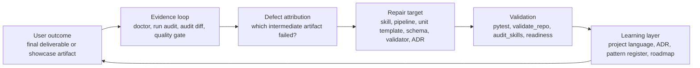

# Harness Improvement Loop

This document defines how the Auto Research Harness should improve after a
run. It is the architecture bridge between a final deliverable, the
intermediate artifacts that shaped it, and the repo-level assets that should
change before the next run.

The current repository already has the necessary substrate: workflow
protocols, execution ledgers, human checkpoints, doctor reports, run audits,
audit diffs, schema references, ADRs, a pattern register, and a roadmap. The
improvement loop gives those pieces a stricter control model.

## Core Thesis

The harness should not be judged only by whether a first run finishes. It
should be judged by whether the run leaves enough evidence to make the next
run better.

```text
final deliverable defect
-> intermediate artifact diagnosis
-> protocol, skill, or harness repair
-> audit or diff evidence
-> reusable project asset
```

This is a bounded self-improvement loop, not an unconstrained self-modifying
agent. The loop is allowed to propose and implement repo changes only through
visible files, validation, tests, ADRs, and human-readable rationale.

## Control Loop



The important move is defect attribution. A weak final artifact should not
trigger vague rewriting. It should ask which earlier interface failed:

- Was the workflow protocol missing a checkpoint or artifact contract?
- Was a skill description too broad, too verbose, or under-specified?
- Was an intermediate artifact readable by people but not by tools?
- Was a machine-readable sidecar present but not stable enough to compare?
- Was a model capability gap left without a harness fallback?
- Did a repair improve the run, or merely change files?

## Intermediate Artifact Discipline

Intermediate artifacts are the harness's working memory. They should be
designed as interfaces, not leftovers.

| Artifact form | Primary reader | Current repo examples | Use it for |
|---|---|---|---|
| Human-readable report | user, reviewer, future maintainer | `DOCTOR_REPORT.md`, `RUN_AUDIT.md`, `QUALITY_GATE.md`, showcase README files | narrative diagnosis, handoff, checkpoint review |
| Machine-readable table | model, scripts, lightweight tools | `UNITS.csv`, `papers/core_set.csv`, extraction tables | staged execution, evidence extraction, deterministic routing |
| Machine-readable sidecar | validator, comparison tool, future dashboard | `DOCTOR_REPORT.json`, `RUN_AUDIT.json`, `RUN_AUDIT_DIFF.json`, unit manifests | compatibility checks, diffs, regression tracking |
| Structured protocol | operator, Codex, validation | `pipelines/*.pipeline.md`, `templates/UNITS.*.csv` | reusable workflow shape and artifact contracts |
| Repo-level learning | project maintainer | `docs/PROJECT_LANGUAGE.md`, `docs/adr/`, `docs/PATTERN_REGISTER.md` | reusable decisions and naming discipline |

Design rule: if an artifact is used by a person, give it a compact report. If
it is used by a tool or future agent, give it a simple structured surface:
CSV, TSV, YAML, or versioned JSON. Do not force tools to scrape prose unless
there is no stable consumer yet.

## Defect Attribution Matrix

| Observed final problem | Likely upstream cause | Repair surface |
|---|---|---|
| Final report is coherent but weakly evidenced | evidence artifact is too thin, extraction fields are missing, or citation checks are late | skill reference, unit acceptance, evidence table schema, quality gate |
| Final report is verbose or repetitive | writing skill lacks a compression contract or the pipeline lacks a synthesis checkpoint | skill prompt, self-loop unit, target artifact definition |
| A run stalls after interruption | execution ledger lacks enough recoverable state or doctor output lacks a repair class | doctor issue category, status transition, workspace contract test |
| A later stage cannot locate inputs | intermediate artifacts are human-readable only or paths are implicit | unit template outputs, manifest, schema reference, run audit |
| A repair cannot prove improvement | no baseline audit, no audit diff, or target artifacts are not comparable | `RUN_AUDIT.json`, `RUN_AUDIT_DIFF.json`, showcase audit |
| Model output degrades under weaker models | skill description is too open-ended or the pipeline lacks forced structure | tighter skill contract, smaller units, required intermediate table, human checkpoint |
| User cannot intervene naturally | checkpoint state is unclear or decisions live only in chat | `CHECKPOINTS.md`, `DECISIONS.md`, human checkpoint language |
| Developers cannot maintain the project | repo-level lessons are scattered across chat or private notes | ADR, project language, roadmap, validation rule |

## Token Efficiency Principles

The improvement loop should reduce wasted model work rather than add ritual.

1. Prefer small intermediate artifacts that can be re-read cheaply.
2. Route models through tables or compact ledgers when full prose is not needed.
3. Keep final deliverables reader-first, but keep internal checks structured.
4. Split large semantic work into units only when the split creates a reusable
   artifact, checkpoint, or repair point.
5. Use doctor and audit output before rerunning expensive units.
6. Promote repeated failures into validation or skill contracts so the same
   issue is not rediscovered by chat.

## Human-In-The-Loop Model

Human intervention is part of the harness, not an exception to it.

Current repo surfaces:

- `CHECKPOINTS.md` names stage boundaries.
- `DECISIONS.md` records run-local approvals and choices.
- Pipeline contracts define checkpoints and quality contracts.
- Doctor and run audit expose what is blocked, missing, or safe to continue.

Target behavior: a user should be able to intervene with natural language, and
the operator should translate that intervention into a durable state change:
decision record, updated unit status, revised artifact, or repo-level ADR when
the choice affects future runs.

## Developer Maintenance Boundary

The repo has two kinds of memory:

| Memory type | Visibility | Examples | Rule |
|---|---|---|---|
| Run-local or developer-local memory | ignored/private | `workspaces/<name>/`, `workspaces/harness-upgrade/GOAL_STATUS.md` | keep execution traces and private iteration logs here |
| Product and architecture memory | tracked/public | README, `docs/`, `pipelines/`, `templates/`, `.codex/skills/`, tests | commit only artifacts that help users or maintainers understand and reuse the system |

This separation matters for product trust. A commit should expose the improved
contract, example, validation, or documentation. It should not require readers
to inspect private scratch state to understand why the repo changed.

## Product Surfaces

The same harness can serve different readers when the output shape is explicit:

| Audience | First thing they should see | Useful product form |
|---|---|---|
| Individual researcher | final brief, tutorial, review, or synthesis | natural-language deliverable plus traceable evidence |
| Research group or lab | comparable run summaries and decision trails | run audit, audit diff, artifact packs |
| B-side knowledge team | repeatable workflow with review checkpoints | workflow protocol, human checkpoint, structured evidence tables |
| Open-source evaluator | clear architecture and verifiable examples | showcase, system map, schema docs, local checks |
| Maintainer | drift signals and upgrade path | validation, skill audit, readiness audit, roadmap |

The current showcase and schema docs support this direction. The next product
step should be better artifact packs and reader-first summaries, not a heavy
runtime service.

## Feature Brainstorm

These ideas are architecture-aligned because they strengthen existing repo
surfaces instead of inventing a separate product:

1. Artifact pack export: collect final deliverable, intermediate reports,
   machine-readable sidecars, and decisions into a portable review package.
2. Run scorecard: summarize one workspace by deliverable coverage, evidence
   depth, unresolved issues, and human checkpoints.
3. Improvement suggestion report: map final-deliverable defects to likely
   skill, pipeline, artifact, or validator repairs.
4. Natural-language checkpoint command: translate "approve outline but rerun
   evidence extraction" into `DECISIONS.md` plus unit status changes.
5. Skill card index: expose each high-frequency skill as purpose, input,
   output, guardrail, and failure mode.
6. Auto research pilot mode: let a policy loop choose the next unit only inside
   an initialized workspace and only after doctor/audit checks pass.
7. Lightweight benchmark corpus: curate a few completed workspaces before
   adding a dashboard or external evaluator.

The durable sequence is: artifact discipline first, improvement report second,
autonomous policy loop last.

## Architecture Constraints

1. The harness may diagnose and compare without approval; mutation should be
   explicit and visible.
2. Machine-readable artifacts need stable field contracts before downstream
   tools depend on them.
3. A new layer is justified only when it improves locality or leverage.
4. A final deliverable should always be traceable back to intermediate
   artifacts, evidence, decisions, and protocol.
5. Self-improvement claims require evidence: a before/after audit, a test, a
   validation rule, or an ADR.
6. The project should stay file-first until repeated completed workspaces prove
   that a database, scheduler, or benchmark dashboard is necessary.
