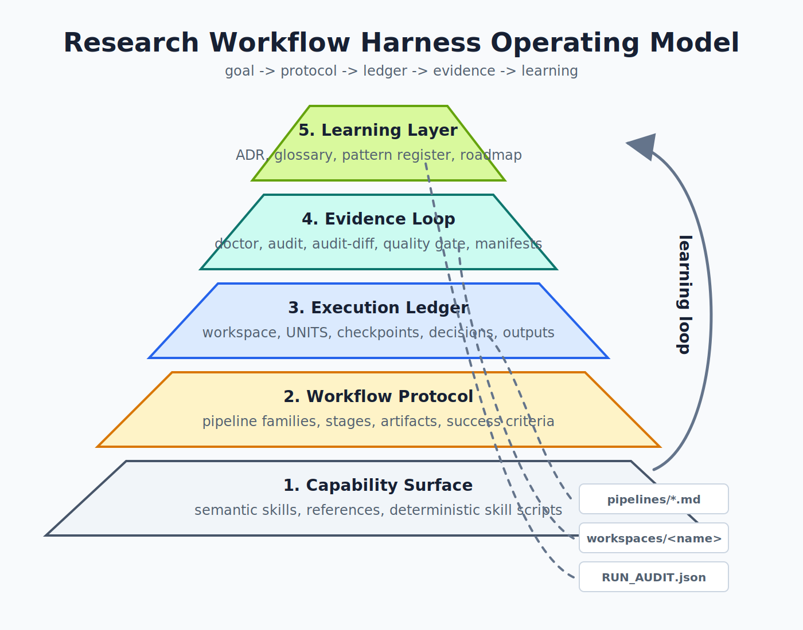

# Harness Operating Model

This document is the conceptual front door for the project. It reframes the
repo as an Auto Research Harness instead of a catalog of skills, pipeline
files, and developer commands.

The concrete implementation still lives in `.codex/skills/`, `pipelines/`,
`templates/UNITS.*.csv`, `workspaces/<name>/`, `scripts/`, and `tooling/`.
This operating model explains why those pieces belong together.

For the more formal research-program framing, read
`docs/AUTO_RESEARCH_HARNESS.md`. For a deliverable-first exhibit, read
`docs/HARNESS_SHOWCASE.md`. For the self-improvement control model, read
`docs/HARNESS_IMPROVEMENT_LOOP.md`.

## System Thesis

The project exists to turn open-ended research and writing goals into a
repeatable, evidence-mediated loop:

```text
goal -> workflow protocol -> execution ledger -> evidence loop -> improvement loop -> reusable learning
```

The harness is not the model, and it is not a generic workflow engine. It is
the set of constraints and evidence surfaces that makes model-driven research
work durable:

- a user goal is framed into a named workflow protocol
- the protocol is materialized as a run ledger
- each step produces durable artifacts instead of relying on chat memory
- evidence tools diagnose, audit, and compare the run
- final-deliverable defects are traced back to intermediate artifacts,
  protocols, skills, or harness checks
- recurring lessons are promoted into skills, docs, validation, ADRs, or
  roadmap decisions

In this sense, the harness optimizes the conditions under which a model works:
it protocolizes the task, externalizes state, audits evidence, and preserves
the lessons that should influence the next run.

## Pyramid Model



The architecture should be read from bottom to top:

| Layer | Role | Current repo surface |
|---|---|---|
| Capability Surface | Reusable semantic judgment units | `.codex/skills/`, `SKILLS_STANDARD.md`, `SKILL_INDEX.md`, skill references and deterministic skill scripts |
| Workflow Protocol | A constrained task shape with stages, artifacts, checkpoints, and success criteria | `pipelines/*.pipeline.md`, `templates/UNITS.*.csv`, `docs/PIPELINE_TAXONOMY.md` |
| Execution Ledger | Durable per-run state that can be resumed, inspected, and handed off | `workspaces/<name>/`, `PIPELINE.lock.md`, `GOAL.md`, `UNITS.csv`, `STATUS.md`, `CHECKPOINTS.md`, `DECISIONS.md` |
| Evidence Loop | Checks and reports that decide whether a run is healthy enough to continue | `pipeline.py doctor`, `pipeline.py audit`, `pipeline.py audit-diff`, quality gates, unit manifests, schema sidecars |
| Learning Layer | Repo-level memory that makes future runs better | `docs/PROJECT_LANGUAGE.md`, `docs/adr/`, `docs/PATTERN_REGISTER.md`, `docs/HARNESS_ROADMAP.md`, validation tests |

The lower layers make work possible. The upper layers make work compound.

The improvement loop is not a separate folder layer. It is the control law
that connects final deliverables, intermediate artifacts, evidence reports,
and repo-level learning. A weak first run should leave enough traceable
evidence to improve the next run without relying on chat memory.

## Improvement Loop

The harness improves through visible artifacts:

```text
final artifact defect
-> intermediate artifact diagnosis
-> skill, pipeline, schema, validator, or ADR repair
-> validation or audit-diff evidence
-> reusable project memory
```

This is the repo's current bounded self-improvement model. It does not assume
a fully autonomous planner. It assumes that a developer or Codex can inspect
the final deliverable, use doctor/audit/audit-diff reports to locate the weak
intermediate artifact, then promote the repair into a tracked contract.

Two artifact forms should normally coexist:

- human-readable reports for review, handoff, and intervention
- machine-readable CSV, TSV, YAML, or versioned JSON surfaces for tools,
  validators, and future agents

Use `docs/HARNESS_IMPROVEMENT_LOOP.md` as the detailed design reference before
adding new self-loop behavior, artifact-pack output, or autonomous research
policy.

## Flow Model

The golden path is:

1. A user describes a research or writing outcome.
2. The reader or operator can inspect the expected deliverable shape first,
   using `docs/HARNESS_SHOWCASE.md` or the relevant workflow guide.
3. The operator or Codex selects a workflow protocol from the README, taxonomy,
   or routing hints.
4. `pipeline.py kickoff` or `pipeline.py init` locks the protocol into a
   workspace.
5. `UNITS.csv` becomes the executable task graph.
6. Skills perform semantic work and write artifacts into the execution ledger.
7. Quality gates, doctor reports, run audits, manifests, and audit diffs expose
   whether the run can continue or needs repair.
8. Final-deliverable defects are attributed to intermediate artifacts,
   workflow protocol gaps, skill contracts, model-capability limits, or
   harness fallback gaps.
9. Recurring lessons become project language, ADRs, pattern-register entries,
   validation rules, pipeline edits, or skill improvements.

The current CLI commands are implementation adapters for this flow. They should
not dominate the architecture story.

## Architectural Constraints

These constraints should guide future changes:

1. Keep semantic judgment in skills. Keep repeatability in the harness.
2. Promote a workflow only when it has a protocol: stages, expected artifacts,
   checkpoints, and success criteria.
3. Treat each workspace as an execution ledger, not scratch space.
4. Do not rely on chat memory for run state, approvals, or repair decisions.
5. Evidence tools should observe and explain before they mutate.
6. Machine-readable sidecars should exist for tools that need stable contracts.
7. A comparison surface should stay file-first until repeated completed runs
   justify a database or dashboard.
8. External architecture patterns must map to current repo mechanisms before
   they become project language.
9. Self-improvement claims require evidence: a before/after audit, test,
   validation rule, ADR, or durable artifact diff.

## Naming Guidelines

Use these names when explaining the architecture:

| Prefer | Use it for | Avoid as primary story |
|---|---|---|
| Operating model | The whole system shape | A flat list of scripts |
| Capability surface | Skills and reusable semantic judgment | "Skill library" as the full project identity |
| Workflow protocol | Pipeline-level contract and stage discipline | "Pipeline file" when explaining intent |
| Execution ledger | A workspace as durable run state | "Workspace folder" as the full meaning |
| Evidence loop | Doctor, audit, audit diff, quality gate, manifests | Tool names as the architecture headline |
| Learning layer | ADRs, glossary, pattern register, roadmap, validation | "Docs" as passive documentation |

These names do not require immediate file renames. They are conceptual names
for the story and future docs.

## Alignment With Current Project Reality

This model is grounded in current repo facts:

- The project has eight workflow capabilities, seven executable pipeline
  contracts, and one guided thesis workflow.
- Executable protocols already have pipeline contracts and unit templates.
- Workspaces already contain pipeline locks, goals, units, statuses,
  checkpoints, decisions, outputs, reports, and logs.
- Doctor and run audit already produce Markdown reports plus JSON sidecars.
- Audit diff now compares two run audit payloads, but it is not a benchmark
  dashboard.
- The project already has validation, tests, CI, ADRs, schema docs, a pattern
  register, and readiness evidence.
- The project has enough evidence surfaces to support bounded
  self-improvement, but not yet enough completed-run corpus to justify a full
  autonomous policy loop or benchmark dashboard.

The model should therefore elevate the story, not pretend the repo has a
separate orchestration service, database, scheduler, or autonomous planner.

## External Design Sources

This model borrows discipline from mature systems without adopting their
runtimes:

- Temporal: durable execution makes long work recoverable through persisted
  workflow state. Current mapping: `UNITS.csv`, status transitions, stale
  `DOING` recovery, and run-local logs.
- LangGraph: checkpointing and persistence make agent state inspectable across
  turns and human-in-the-loop steps. Current mapping: `STATUS.md`,
  `DECISIONS.md`, and workspace-local ledgers.
- DVC: dependencies and outputs make pipelines reproducible and comparable.
  Current mapping: pipeline target artifacts, unit `inputs`, unit `outputs`,
  manifests, run audit, and audit diff.
- OpenAI evals: agent quality improves when behavior is measured by stable
  eval runs and datasets. Current mapping: quality gates and audit diff; full
  semantic benchmark dashboards remain deferred.

## Boundary Of The Model

This repo is not yet:

- a fully autonomous research agent runtime
- a distributed workflow scheduler
- a database-backed run store
- a benchmark dashboard with a stable corpus
- an executable thesis automation pipeline

Those can become future layers only when the execution ledger and evidence loop
show repeated pressure for them.
