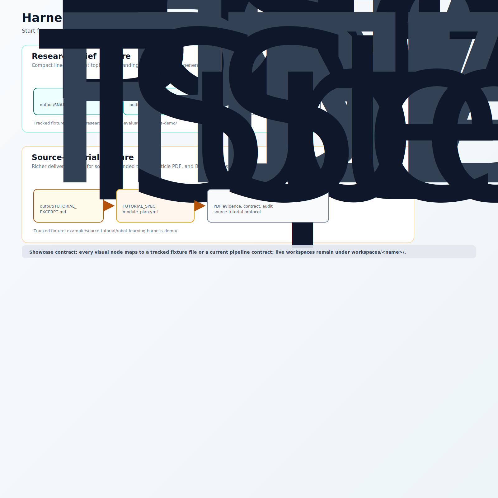

# Harness Showcase

This document is the reader-facing exhibit path for the repository. It starts
from deliverables, then traces backward into protocols, ledgers, and evidence.

The showcase complements `docs/HARNESS_RUN_WALKTHROUGH.md`. The walkthrough
proves that the CLI can initialize, diagnose, and audit a workspace. This
showcase explains how a reader should inspect the result of a workflow first,
then use the harness to understand how the result was constrained.

## Showcase Principle

Readers usually ask:

```text
What does this system produce?
```

The harness should answer that before asking them to learn every internal
contract. The preferred inspection path is:

```text
final deliverable
-> intermediate reasoning artifacts
-> workflow protocol
-> execution ledger
-> evidence reports
-> reusable lessons
```

## Lineage Diagram



Canonical asset path: `docs/assets/harness-showcase-lineage.svg`.

The diagram compares the two tracked fixtures:

- `research-brief` is the compact path: a brief snapshot plus enough outline,
  taxonomy, and contract evidence to demonstrate artifact lineage.
- `source-tutorial` is the richer delivery path: a tutorial excerpt plus
  source, module, self-check, PDF/slide delivery, contract, and audit evidence.

## Showcase Audit

The portable exhibit has a lightweight audit contract:

```bash
python scripts/showcase_audit.py --strict
```

Schema: `harness-showcase-audit.v1`.

The audit checks that this document references the tracked fixture paths, that
the visual lineage asset still contains the expected fixture labels, that the
fixture protocol files exist, and that the tracked deliverables are not
placeholder-only examples. It is intentionally narrower than a live run audit:
it does not rerun retrieval, compile LaTeX, or judge semantic quality.

The same audit also emits a conservative fixture scorecard. The scorecard is
not a benchmark. It only counts whether each portable fixture exposes its
tracked files and required evidence markers, so readers can compare coverage
without mistaking it for semantic research quality.

## Tracked Research-Brief Fixture

The tracked fixture lives at:

```text
example/research-brief/rag-evaluation-harness-demo/
```

The fixture guide is:

```text
example/research-brief/rag-evaluation-harness-demo/README.md
```

Start with the deliverable:

```text
example/research-brief/rag-evaluation-harness-demo/output/SNAPSHOT.md
```

Then trace backward:

| Step | File |
|---|---|
| Final product | `example/research-brief/rag-evaluation-harness-demo/output/SNAPSHOT.md` |
| Outline | `example/research-brief/rag-evaluation-harness-demo/outline/outline.yml` |
| Taxonomy | `example/research-brief/rag-evaluation-harness-demo/outline/taxonomy.yml` |
| Core set | `example/research-brief/rag-evaluation-harness-demo/papers/core_set.csv` |
| Self-check | `example/research-brief/rag-evaluation-harness-demo/output/DELIVERABLE_SELFLOOP_TODO.md` |
| Contract check | `example/research-brief/rag-evaluation-harness-demo/output/CONTRACT_REPORT.md` |
| Handoff manifest excerpt | `example/research-brief/rag-evaluation-harness-demo/output/ARTIFACT_PACK_EXCERPT.md` |
| Machine-readable excerpt | `example/research-brief/rag-evaluation-harness-demo/output/ARTIFACT_PACK_EXCERPT.tsv` |
| Workflow protocol | `pipelines/research-brief.pipeline.md` |

This fixture is intentionally small. It demonstrates artifact lineage, not a
full live retrieval run. The artifact-pack excerpt uses repo-relative paths so
it can be tracked under `example/` without embedding a developer's local
workspace path. Future refreshed excerpts should be generated from a live
workspace with `pipeline.py pack --write-excerpt`, then curated into the
tracked fixture when appropriate.

## Tracked Source-Tutorial Fixture

The tracked `source-tutorial` fixture lives at:

```text
example/source-tutorial/robot-learning-harness-demo/
```

The fixture guide is:

```text
example/source-tutorial/robot-learning-harness-demo/README.md
```

Start with the final tutorial excerpt:

```text
example/source-tutorial/robot-learning-harness-demo/output/TUTORIAL_EXCERPT.md
```

Then trace backward and outward:

| Step | File |
|---|---|
| Final tutorial excerpt | `example/source-tutorial/robot-learning-harness-demo/output/TUTORIAL_EXCERPT.md` |
| Tutorial spec | `example/source-tutorial/robot-learning-harness-demo/output/TUTORIAL_SPEC_EXCERPT.md` |
| Module plan | `example/source-tutorial/robot-learning-harness-demo/outline/module_plan.yml` |
| Source manifest summary | `example/source-tutorial/robot-learning-harness-demo/sources/manifest.summary.yml` |
| Tutorial self-check | `example/source-tutorial/robot-learning-harness-demo/evidence/TUTORIAL_SELFLOOP.md` |
| PDF and slide delivery evidence | `example/source-tutorial/robot-learning-harness-demo/evidence/DELIVERY_EVIDENCE.md` |
| Artifact contract evidence | `example/source-tutorial/robot-learning-harness-demo/evidence/CONTRACT_REPORT.md` |
| Run audit summary | `example/source-tutorial/robot-learning-harness-demo/evidence/RUN_AUDIT_SUMMARY.md` |
| Handoff manifest excerpt | `example/source-tutorial/robot-learning-harness-demo/evidence/ARTIFACT_PACK_EXCERPT.md` |
| Machine-readable excerpt | `example/source-tutorial/robot-learning-harness-demo/evidence/ARTIFACT_PACK_EXCERPT.tsv` |
| Workflow protocol | `pipelines/source-tutorial.pipeline.md` |

This fixture demonstrates a richer product chain than the research-brief
fixture: source set, tutorial spec, teaching modules, article prose, article
PDF, Beamer slides, self-check, contract report, and run audit.
Its artifact-pack excerpt uses the same relative-path pattern as the compact
research-brief fixture, but covers richer delivery surfaces and separate
human-readable versus model-readable evidence. Future refreshed excerpts should
use `pipeline.py pack --write-excerpt` as the source before curating
fixture-specific role labels.

## Completed Local Workspace Exhibit

If this checkout includes the ignored local workspace
`workspaces/source-tutorial-real-e2e-20260412/`, it is the strongest current
end-to-end exhibit because it contains real tutorial prose, article PDF, slide
PDF, completed units, and a passing contract report.

Use it in this order:

```bash
WS=workspaces/source-tutorial-real-e2e-20260412
sed -n '1,120p' "$WS/output/TUTORIAL.md"
test -f "$WS/latex/main.pdf"
test -f "$WS/latex/slides/main.pdf"
uv run python scripts/pipeline.py doctor --workspace "$WS"
uv run python scripts/pipeline.py audit --workspace "$WS"
sed -n '1,80p' "$WS/PIPELINE.lock.md"
sed -n '1,35p' "$WS/UNITS.csv"
sed -n '1,120p' pipelines/source-tutorial.pipeline.md
sed -n '1,80p' "$WS/output/CONTRACT_REPORT.md"
```

Expected evidence from that local workspace:

- `output/TUTORIAL.md` is a real tutorial, not a placeholder.
- `latex/main.pdf` exists.
- `latex/slides/main.pdf` exists.
- `UNITS.csv` has all source-tutorial units marked `DONE`.
- `output/CONTRACT_REPORT.md` reports `Status: PASS`.
- `pipeline.py doctor` reports no harness issues.
- `pipeline.py audit` reports `PASS`.

Because `workspaces/` is ignored by git, this workspace is not a portable
fixture. It is useful for local demonstration and regression checks when
available, but tracked examples should live under `example/`.

## What This Proves

The showcase demonstrates that the project is not merely a collection of
skills. It can explain a workflow as a chain of deliverables and evidence:

- a reader-facing output
- intermediate artifacts that explain how the output was constructed
- a protocol that defines the expected stages and target artifacts
- a ledger that records the run state
- reports that decide whether the run is healthy

## What It Does Not Prove

The showcase does not prove broad semantic benchmark quality. That requires a
stable corpus of comparable runs, evaluation criteria, and regression history.
Those remain deferred in `docs/HARNESS_ROADMAP.md` and
`docs/PATTERN_REGISTER.md`.
