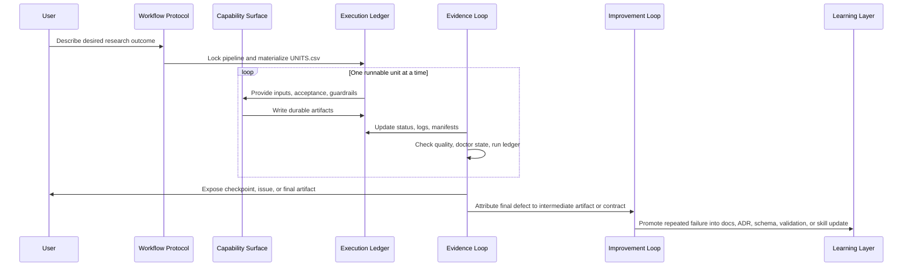
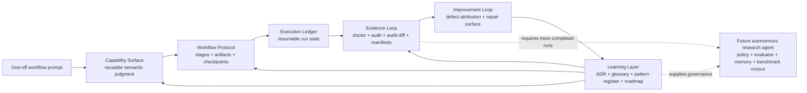

# Harness System Map

This document is the runtime map for the current
`research-units-pipeline-skills` architecture. It complements
`docs/HARNESS_OPERATING_MODEL.md` by showing how the five operating-model
layers interact during one run and how repeated runs turn into reusable harness
assets. `docs/HARNESS_IMPROVEMENT_LOOP.md` defines the self-improvement
control law that sits across those layers. `docs/ARTIFACT_INTERFACE_STANDARD.md`
defines the interface discipline for durable intermediate artifacts.

For a command-level example of the same loop, read
`docs/HARNESS_RUN_WALKTHROUGH.md`.
For a deliverable-first exhibit, read `docs/HARNESS_SHOWCASE.md`.

## Project-Specific Diagram


This SVG is hand-authored from current repo files and command surfaces. It uses
the same five-layer language as the operating model, with the improvement loop
treated as a cross-layer control path rather than a sixth folder layer:

- Capability Surface
- Workflow Protocol
- Execution Ledger
- Evidence Loop
- Learning Layer
- Improvement Loop across final artifacts, intermediate diagnostics, repair
  surfaces, and validation evidence

It is meant to be readable, but not speculative: if a mechanism does not exist
in this repository, it should not appear in the diagram. The Mermaid diagrams
below remain the compact source for reviewing relationships in diffs.

## Current Usage Boundary

There are two supported ways to enter the system today:

1. Interactive Codex/operator use: start Codex in this repo, choose a workflow
   by name or describe the desired outcome, then let the selected workflow
   protocol write artifacts under `workspaces/<name>/`.
2. Repo-local CLI use:

   ```bash
   python scripts/pipeline.py kickoff --topic "<research goal>" --pipeline arxiv-survey
   python scripts/pipeline.py init --workspace workspaces/<name> --pipeline arxiv-survey
   python scripts/pipeline.py run --workspace workspaces/<name>
   python scripts/pipeline.py doctor --workspace workspaces/<name> --write
   python scripts/pipeline.py audit --workspace workspaces/<name> --write
   python scripts/pipeline.py audit-diff --before <old-RUN_AUDIT.json> --after <new-RUN_AUDIT.json> --write
   python scripts/pipeline.py improve --workspace workspaces/<name> --write
   ```

`kickoff` can auto-pick from routing hints when `--pipeline` is omitted, but
that is not a full autonomous planner. Seven workflows are executable workflow
protocols today. `graduate-paper` is a guided thesis workflow framework and
should not be drawn as an executable `pipeline.py init` target until it has a
frontmatter contract and unit template.

## Runtime Relationship

```mermaid
flowchart TB
    user["User goal\nnatural-language research/workflow request"]

    subgraph capability["Capability Surface"]
        skills[".codex/skills/*/SKILL.md\nsemantic judgment, guardrails, acceptance"]
        skill_refs["references/ + assets/\nexamples, rubrics, reusable shapes"]
        skill_scripts["skill scripts\ndeterministic helpers"]
    end

    subgraph protocol["Workflow Protocol"]
        readme["README + feature guides\nworkflow choice"]
        taxonomy["docs/PIPELINE_TAXONOMY.md\nfamilies, maturity, deliverables"]
        pipeline["pipelines/*.pipeline.md\nstages, target artifacts, quality contract"]
        units_template["templates/UNITS.*.csv\nunit graph and acceptance"]
    end

    subgraph ledger["Execution Ledger"]
        lock["PIPELINE.lock.md\nselected protocol"]
        goal["GOAL.md\nrun intent"]
        units["UNITS.csv\ncurrent executable work"]
        state["STATUS.md + CHECKPOINTS.md + DECISIONS.md\nprogress and human gates"]
        outputs["output/*\nreports, drafts, audits, manifests"]
    end

    subgraph evidence["Evidence Loop"]
        cli["scripts/pipeline.py\nkickoff, init, run, doctor, audit, audit-diff, improve, pack"]
        executor["tooling/executor.py\nstatus transitions, stale DOING recovery"]
        quality["tooling/quality_gate.py\nartifact checks"]
        doctor["doctor-report.v1\nworkspace diagnosis"]
        run_audit["run-audit.v1 + run-audit-diff.v1\nrun evidence and comparison"]
        improve_report["improvement-report.v1\nrepair map"]
        artifact_pack["artifact-pack.v1\ndeliverable-first manifest"]
        tests["tests/ + local harness checks\nsmoke and regression checks"]
    end

    subgraph learning["Learning Layer"]
        language["docs/PROJECT_LANGUAGE.md\ncanonical terms"]
        adr["docs/adr/\narchitecture decisions"]
        patterns["docs/PATTERN_REGISTER.md\nexternal patterns mapped to repo files"]
        roadmap["docs/HARNESS_ROADMAP.md\nadopted, deferred, next work"]
        improve["docs/HARNESS_IMPROVEMENT_LOOP.md\nbounded self-improvement model"]
        artifact_standard["docs/ARTIFACT_INTERFACE_STANDARD.md\nartifact interface standard"]
        readiness["docs/HARNESS_READINESS.md\ncompletion evidence ledger"]
        validate["scripts/validate_repo.py\ncontract/docs/ADR/schema validation"]
        audit_skills["scripts/audit_skills.py\nskill hygiene and JSON report"]
        graph["scripts/generate_skill_graph.py\ndependency docs"]
    end

    user --> readme
    user --> taxonomy
    readme --> pipeline
    taxonomy --> pipeline
    pipeline --> units_template
    pipeline --> skills
    units_template --> skills
    skills --> skill_refs
    skills --> skill_scripts

    pipeline --> lock
    user --> goal
    units_template --> units
    lock --> units
    units --> state
    units --> outputs

    cli --> lock
    cli --> units
    cli --> outputs
    executor --> units
    executor --> outputs
    quality --> outputs
    skill_scripts --> executor
    outputs --> doctor
    outputs --> run_audit
    doctor --> improve_report
    run_audit --> improve_report
    outputs --> artifact_pack
    doctor --> artifact_pack
    run_audit --> artifact_pack
    improve_report --> artifact_pack
    doctor --> readiness
    run_audit --> readiness
    improve_report --> readiness
    artifact_pack --> readiness

    validate --> pipeline
    validate --> units_template
    validate --> learning
    audit_skills --> skills
    audit_skills --> roadmap
    graph --> skills
    graph --> units_template
    tests --> evidence
    tests --> learning

    outputs --> improve
    doctor --> improve
    run_audit --> improve
    improve_report --> improve
    improve --> artifact_standard
    artifact_standard --> outputs
    artifact_standard --> validate
    improve --> skills
    improve --> pipeline
    improve --> validate
    outputs --> roadmap
    patterns --> adr
    adr --> validate
    language --> readme
    roadmap --> readme
    learning --> capability
    learning --> protocol
    learning --> evidence
```

Read the diagram as an operating-model loop:

1. A user starts with an outcome, not a file path.
2. The Workflow Protocol constrains the task shape: workflow family, pipeline,
   unit template, target artifacts, and success criteria.
3. The Capability Surface supplies semantic judgment and deterministic helpers.
4. The Execution Ledger records selected protocol, unit state, checkpoints,
   decisions, outputs, errors, doctor reports, run audits, and manifests.
5. The Evidence Loop diagnoses and compares the run without relying on chat
   memory.
6. The Improvement Loop attributes final-deliverable defects to weak
   intermediate artifacts, workflow protocol gaps, skill-contract issues,
   model-capability limits, or missing harness fallbacks.
7. The Learning Layer turns repeated evidence into language, ADRs, pattern
   mappings, roadmap updates, validation, and future skill/pipeline changes.

## Execution Loop



## Evolution Story



This repo did not merely add more skills. It made each level stricter:

| Old shape | Current shape | What became stricter |
|---|---|---|
| A prompt names a workflow | README/taxonomy route to one of 8 workflow capabilities | workflow choice is visible and documented |
| A skill tells the model what to do | Capability Surface with expected inputs, outputs, acceptance criteria, guardrails, references, and deterministic helpers | semantic judgment is inspectable |
| A workflow is a loose sequence | Workflow Protocol with stage contracts, target artifacts, quality contracts, and required capabilities | workflow shape is reusable |
| A run lives in chat | Execution Ledger with `PIPELINE.lock.md`, `GOAL.md`, `UNITS.csv`, `STATUS.md`, `DECISIONS.md`, and `output/*` | state is resumable |
| Failure is a chat explanation | Evidence Loop with `pipeline.py doctor`, `pipeline.py audit`, `audit-diff`, typed reports, and JSON sidecars | recovery and handoff are inspectable |
| Lessons are remembered informally | Learning Layer with ADRs, project language, pattern register, schema docs, validation, and roadmap | experience compounds |

## Auto Research Implication

The current repo is already a substrate for an auto-research or self-improving
agent, but it is not yet a fully autonomous agent runtime.

What exists now:

- workflow catalog: 8 named workflows with documented maturity
- capability surface: `.codex/skills/`
- executable protocols: 7 frontmatter pipeline contracts and 7 unit templates
- execution ledger: workspace-local state files
- evidence loop: doctor reports, run audit, audit diff, quality gates, and
  JSON sidecars
- learning layer: ADRs, glossary, pattern register, roadmap, readiness ledger
- validation: strict repo validation, skill audit, tests, local harness checks

What a future autonomous research agent still needs:

- a policy loop that chooses the next unit without manual prompting
- a stronger evaluator that can judge semantic output quality across completed
  workspaces
- a representative benchmark corpus of completed runs
- explicit memory promotion rules: when a lesson becomes a skill reference,
  validation rule, ADR, glossary term, or roadmap item
- clearer safety and human-approval boundaries for high-risk research,
  citation, and thesis operations

The intended path is therefore:

1. Keep the current file-first harness stable.
2. Accumulate representative completed workspaces.
3. Compare those runs through `RUN_AUDIT.json`, `RUN_AUDIT_DIFF.json`, and
   unit manifests.
4. Promote repeated failures into validation, skills, ADRs, or glossary terms.
5. Only then add a policy/evaluator layer for autonomous execution.
